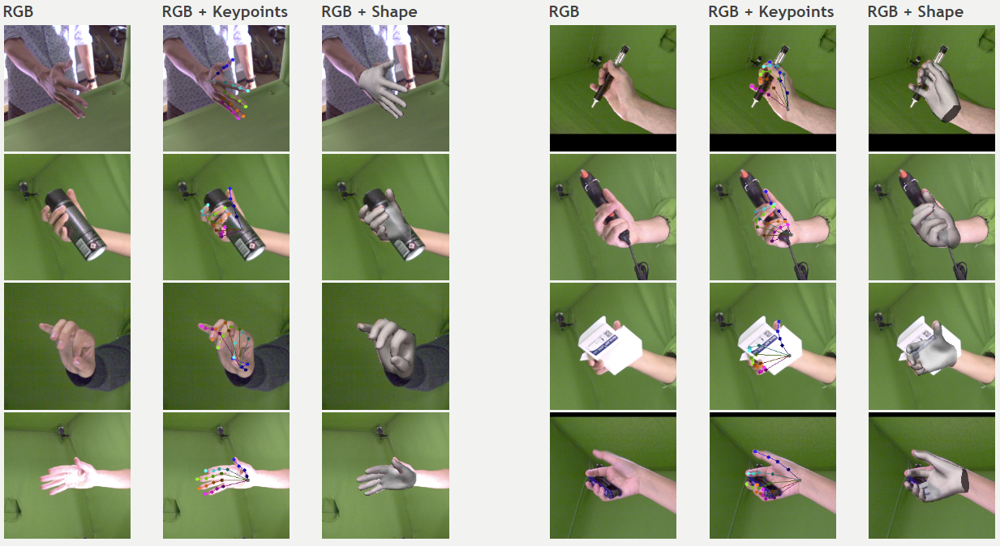
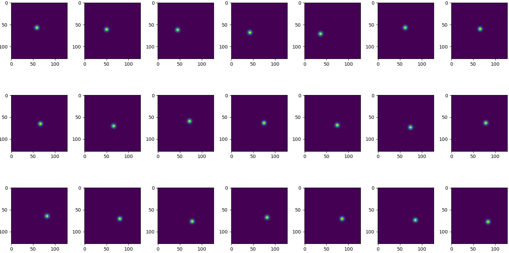
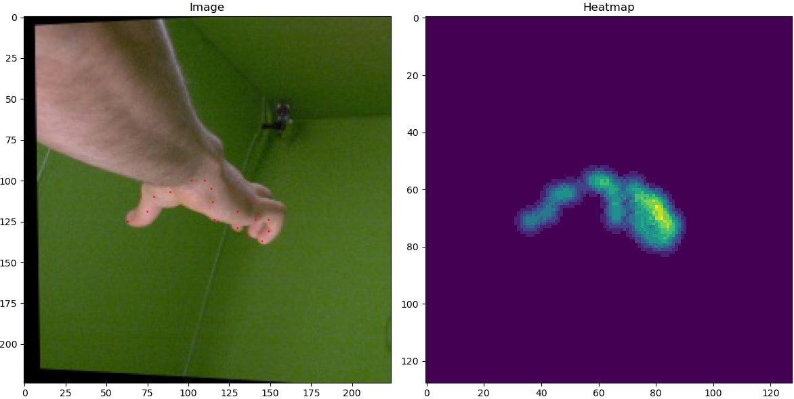
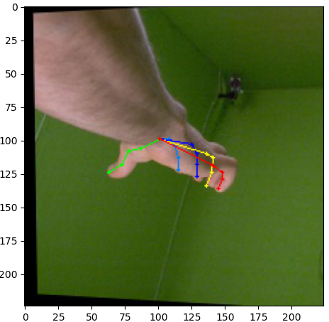

# 2D Pose Hand Estimation in PyTorch

[](https://ubuntu.com/) [](https://www.microsoft.com/windows/) [](https://code.visualstudio.com/) [](https://www.python.org/) [](https://pytorch.org/) [](https://keras.io/) [](https://www.tensorflow.org/) [](https://optuna.org/) [](https://matplotlib.org/) [](https://numpy.org/) [](https://pandas.pydata.org/)

## Overview

This repository contains the PyTorch implementation of a 2D pose hand estimation model. The UNet model is designed to predict the 2D coordinates of key points on a human hand from input images.

## Features

- **PyTorch Implementation:** The entire project is implemented using PyTorch, making it easy to understand, modify, and extend.

- **Data Processing:** Scripts and tools for data preprocessing are included to facilitate dataset preparation.

## Dataset
The FreiHAND Dataset is available on [Uni-Freiburg](https://lmb.informatik.uni-freiburg.de/resources/datasets/FreihandDataset.en.html). Refer to the [paper](https://arxiv.org/pdf/1909.04349.pdf) for details about the dataset. The dataset contains 4*32560 = 130240 training and 3960 evaluation samples. Each training sample provides:
-	RGB image (224x224 pixels)
-	Hand segmentation mask (224x224 pixels)
-	Intrinsic camera matrix K
-	Hand scale (metric length of a reference bone)
-	3D keypoint annotation for 21 Hand Keypoints
-	3D shape annotation

<p align="center">
    
</p>

## Project Structure

- **main.py:** Script for running the training and validation of the model.
- **dataset.py:** Custom dataset class for loading and preprocessing images.
- **early_stopping.py:** Implementation of an early stopping mechanism to prevent overfitting.
- **solver.py:** Training and validation logic.
- **utils.py:** Utility functions for plotting results.
- **models.py:** UNet and IoULoss implementation.

## Installation

1. Clone the repository:

    ```bash
    https://github.com/iamvincenzo/pytorch-deep-learning-computer-vision.git
    cd 2D-hand-pose-estimation
    ```

2. Create a Conda environment:

    ```bash
    conda create -n pytorchEnv
    conda activate pytorchEnv
    ```

2. Install dependencies:

    ```bash
    conda install pytorch torchvision torchaudio cpuonly -c pytorch
    conda install -c anaconda pillow
    conda install -c conda-forge matplotlib
    conda install -c conda-forge pytorch-model-summary
    conda install -c conda-forge torchmetrics
    conda install -c conda-forge optuna
    conda install -c anaconda scikit-learn
    conda install -c anaconda numpy
    conda install -c anaconda pandas
    conda install -c anaconda tqdm
    ```
## How to Run

1. Navigate to the project directory:

    ```bash
    cd 2D-hand-pose-estimation
    ```

2. Run the main program:

    ```bash
    python main.py
    ```

## Results

<p align="center">
    
</p>

<p align="center">
    
</p>

<p align="center">
    
</p>

## License

This project is licensed under the [GNU GENERAL PUBLIC LICENSE  Version 3](../LICENSE).