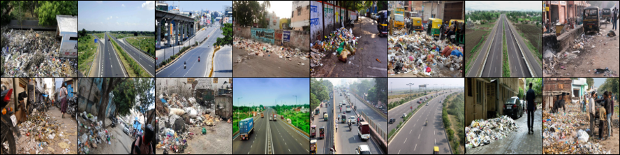
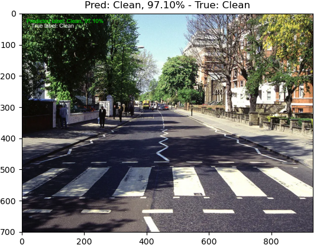
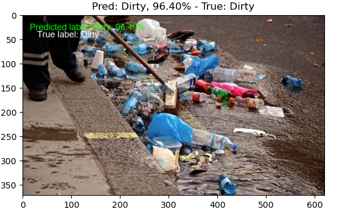

# Street Cleaning Binary Classification

[](https://ubuntu.com/) [](https://www.microsoft.com/windows/) [](https://code.visualstudio.com/) [](https://www.python.org/) [](https://pytorch.org/) [](https://keras.io/) [](https://www.tensorflow.org/) [](https://optuna.org/) [](https://matplotlib.org/) [](https://numpy.org/) [](https://pandas.pydata.org/)

A street cleaning company aims to ensure the effectiveness of their cleaning efforts by verifying whether the streets are clean or contain garbage. This repository contains a solution for a binary classification problem using computer vision. The dataset consists of images representing clean streets (class 0: "clean") and streets with garbage (class 1: "dirty"). The goal is to develop a machine learning model that can accurately distinguish between clean and dirty streets.

## Dataset
The dataset is available on Kaggle at [CleanDirty Road Classification](https://www.kaggle.com/datasets/faizalkarim/cleandirty-road-classification/). It includes a total of 237 images sourced from the internet. The images are divided into two classes: "clean" and "dirty." The dataset also provides a CSV file, `metadata.csv`, mapping each image's filename to its corresponding class label.

<p align="center">
    
</p>

## Project Structure

- **main.py:** Script for running the training and validation of the model in k-fold cross-validation or hold-out split validation mode.
- **custom_dataset.py:** Custom dataset class for loading and preprocessing images.
- **early_stopping.py:** Implementation of an early stopping mechanism to prevent overfitting.
- **hyperparameters_optimization.py:** Script for hyperparameter optimization (optimizer, learning rate, etc.) using Optuna.
- **hold_out_split_validation.py:** Script to launch training and hold-out split validation for model evaluation.
- **k_fold_cross_validation.py:** Script to launch training and k-fold cross-validation for robust model evaluation.
- **solver.py:** Training and validation logic.
- **plotting_utils.py:** Utility functions for plotting results.
- **stats.py:** Computation of statistics for training and validation and plotting.
- **inference.py:** Inference script for making predictions on new test data.

- **keras-binary-classification/main.py:** Script for running the training and validation of the model in k-fold cross-validation with keras-tensorflow.

## Installation

1. Clone the repository:

    ```bash
    https://github.com/iamvincenzo/pytorch-deep-learning-computer-vision.git
    cd binary-classification
    ```

2. Create a Conda environment:

    ```bash
    conda create -n street_classification
    conda activate street_classification
    ```

2. Install dependencies:

    ```bash
    conda install pytorch torchvision torchaudio cpuonly -c pytorch
    conda install -c anaconda pillow
    conda install -c conda-forge matplotlib
    conda install -c conda-forge pytorch-model-summary
    conda install -c conda-forge torchmetrics
    conda install -c conda-forge optuna
    conda install -c anaconda scikit-learn
    conda install -c anaconda numpy
    conda install -c anaconda pandas
    conda install -c anaconda tqdm
    ```

## How to Run

1. Navigate to the project directory:

    ```bash
    cd binary-classification
    ```

2. Run the main program:

    ```bash
    python main.py
    ```

    ### Command-line Arguments

    The following command-line arguments can be used when running the script:

    - `--run_name`: The name assigned to the current run.
    - `--model_name`: The name of the model to be saved or loaded.
    - `--num_epochs`: The total number of training epochs.
    - `--batch_size`: The batch size for training and validation data.
    - `--workers`: The number of workers in the data loader.
    - `--lr`: The learning rate for optimization.
    - `--loss`: The loss function used for model optimization.
    - `--opt`: The optimizer used for training.
    - `--patience`: The threshold for early stopping during training.
    - `--load_model`: Determines whether to load the model from a checkpoint.
    - `--checkpoint_path`: The path to save the trained model.
    - `--num_classes`: The number of classes to predict with the final Linear layer.
    - `--raw_data_path`: Path where to get the raw dataset.
    - `--apply_transformations`: Indicates whether to apply transformations to images.

## Results

<table>
<tr>
<th> Train configuration </th>
<th> Test results </th>
</tr>
<tr>
<td>

| Parameter                 | Value          |
|---------------------------|----------------|
| Model                | ResNet18             |
| Batch Size                | 16             |
| Learning Rate             | 0.004014796    |
| Optimizer                 | RMSprop        |
| Transformations           | Flip, Rotations, Normalization |

</td>

<td>

| Metric                    | Average        |
|---------------------------|----------------|
| Accuracy                  | 92.846%        |
| Loss                      | 0.169          |

</td>
</tr> 
</table>

<table>
<tr>
<th> Train configuration </th>
<th> Test results </th>
</tr>
<tr>
<td>

| Parameter                 | Value          |
|---------------------------|----------------|
| Model                | ResNet18             |
| Batch Size                | 16             |
| Learning Rate             | 0.004014796    |
| Optimizer                 | RMSprop        |
| Transformations           | False          |

</td>

<td>

| Metric                    | Average        |
|---------------------------|----------------|
| Accuracy                  | 95.780%        |
| Loss                      | 0.107          |

</td>
</tr> 
</table>

</td>
</tr> 
</table>

<table>
<tr>
<th> Train configuration </th>
<th> Test results </th>
</tr>
<tr>
<td>

| Parameter                 | Value          |
|---------------------------|----------------|
| Model                | ResNet18             |
| Batch Size                | 16             |
| Learning Rate             | 0.004014796    |
| Optimizer                 | RMSprop        |
| Apply Transformations     | TrivialAugmentWide           |

</td>

<td>

| Metric                    | Average        |
|---------------------------|----------------|
| Accuracy                  | 95.798%        |
| Loss                      | 0.103          |

</td>
</tr> 
</table>

<table>
<tr>
<th> Train configuration </th>
<th> Test results </th>
</tr>
<tr>
<td>

| Parameter                 | Value          |
|---------------------------|----------------|
| Model                | ResNet18             |
| Batch Size                | 16             |
| Learning Rate             | 0.001          |
| Optimizer                 | Adam           |
| Transformations           | Flip, Rotations, Normalization |

</td>

<td>

| Metric                    | Average        |
|---------------------------|----------------|
| Accuracy                  | 95.771%        |
| Loss                      | 0.120          |

</td>
</tr> 
</table>

<table>
<tr>
<th> Train configuration </th>
<th> Test results </th>
</tr>
<tr>
<td>

| Parameter                 | Value          |
|---------------------------|----------------|
| Model                | ResNet18             |
| Batch Size                | 16             |
| Learning Rate             | 0.001          |
| Optimizer                 | Adam           |
| Apply Transformations    | TrivialAugmentWide           |

</td>

<td>

| Metric                    | Average        |
|---------------------------|----------------|
| Accuracy                  | 96.622%        |
| Loss                      | 0.095          |

</td>
</tr> 
</table>

<table>
<tr>
<th> Train configuration </th>
<th> Test results </th>
</tr>
<tr>
<td>

| Parameter                 | Value          |
|---------------------------|----------------|
| Model                | ResNet18             |
| Batch Size                | 16             |
| Learning Rate             | 0.001          |
| Optimizer                 | Adam           |
| Apply Transformations    | False          |

</td>

<td>

| Metric                    | Average        |
|---------------------------|----------------|
| Accuracy                  | 96.197%        |
| Loss                      | 0.091          |

</td>
</tr> 
</table>

<table>
<tr>
<th> Train configuration </th>
<th> Test results </th>
</tr>
<tr>
<td>

| Parameter                 | Value          |
|---------------------------|----------------|
| Model                | MobileNetV2             |
| Batch Size                | 16             |
| Learning Rate             | 0.001          |
| Optimizer                 | Adam           |
| Apply Transformations    | TrivialAugmentWide           |

</td>

<td>

| Metric                    | Average        |
|---------------------------|----------------|
| Accuracy                  | 96.622%        |
| Loss                      | 0.098          |

</td>
</tr> 
</table>

<table>
<tr>
<th> Train configuration </th>
<th> Test results </th>
</tr>
<tr>
<td>

| Parameter                 | Value          |
|---------------------------|----------------|
| Model                | EfficientNet-V2-L            |
| Batch Size                | 16             |
| Learning Rate             | 0.001          |
| Optimizer                 | Adam           |
| Apply Transformations    | TrivialAugmentWide           |

</td>

<td>

| Metric                    | Average        |
|---------------------------|----------------|
| Accuracy                  | 96.613%        |
| Loss                      | 0.171          |

</td>
</tr> 
</table>

<table>
<tr>
<th> Train configuration </th>
<th> Test results </th>
</tr>
<tr>
<td>

| Parameter                 | Value          |
|---------------------------|----------------|
| Model                | VGG-16          |
| Batch Size                | 16             |
| Learning Rate             | 0.001          |
| Optimizer                 | Adam           |
| Apply Transformations    | TrivialAugmentWide           |

</td>

<td>

| Metric                    | Average        |
|---------------------------|----------------|
| Accuracy                  | 96.613%        |
| Loss                      | 0.103          |

</td>
</tr> 
</table>

<p align="center">
    
</p>

<p align="center">
    
</p>

## License

This project is licensed under the [GNU GENERAL PUBLIC LICENSE  Version 3](../LICENSE).
